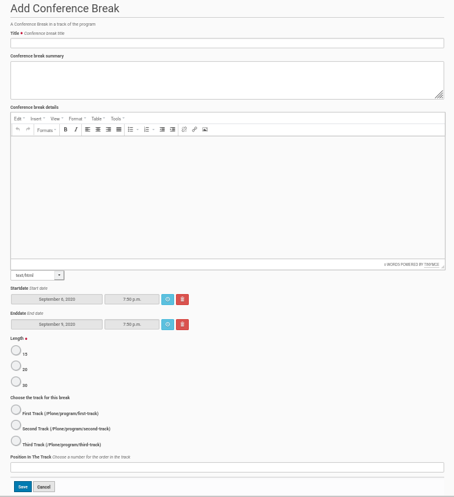

Add A New Conference Break
==========================

The conference breaks could be created only inside the conference breaks folder.
Thus you need to go to this folder inside the Plone site and click 'Add new' on
the menu bar on the left side. The opening submenu contains only the entry
'Conference Break'. Choose this entry and you get the conference break edit
form (see screenshot below).

It is necessary that a conference break needs a title, e.g. 'Lunch Break'. It
could have a summary and a more detailed description, but this is not mandatory.

There is a field to choose the length of the break and another one to assign
it to a track. The last field gets a number for the position inside this track.

Once all mandatory fields are filled, save the form and the conference break
will be created.

