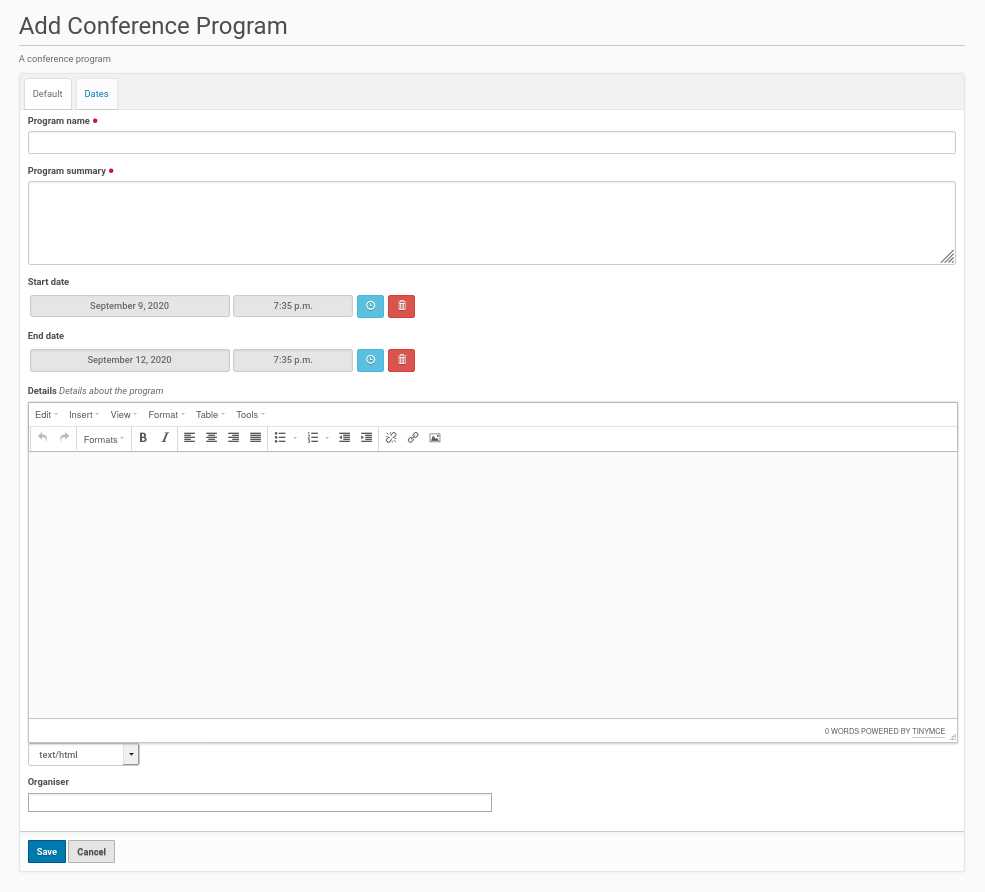

Add A Conference Program
========================

The conference program with tracks will be created inside the conference
program folder. To create this program folder go to the root of the Plone
site and click inside the menu on the left side on the entry 'Add new'.
This will open a submenu. Choose from this submenu the entry 'Conference
Prgram'. This displays the form to create the conference program folder
object (see screenshot below).

This form contains fields to set the title of the conference program and to
give a short summary description. This fields are mandatory.

Then there is field for a more detailed description of the conference
program with the opportunity to e.g. provide links or add pictures and
style text using HTML tags.

The form has also two fields to set the begin and the end of the program.
The tracks of the program had to be within the boundary of this time
slot.

The last field gives the opportunity to add organizers (of the program /
conference).

Once the fields were completed save the edit form and the conference program
folder will be created.

Publishing the program
**********************

The default state of the created folder will be 'private'. If you want to
change this state, click inside the menu bar on the left site on the entry
with this state and choose from the opening submenu 'Submit for Publication'
or if available 'Publish'. If you could only submit the conference program
for publication a user with the appropriate permission need to publish the
program later.