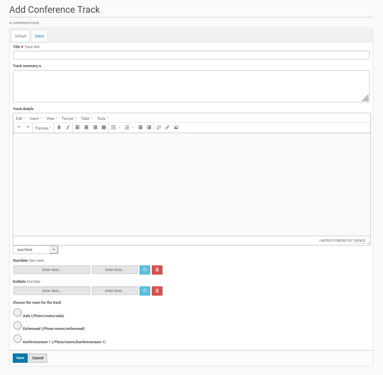

Add A New Conference Track
==========================

It's easy to add a new conference track to the conference program. Once you
created a conference program object, go to this folder object by using its
navigation menu entry. Inside the program (folder) click within the menu bar on
the left side on 'Add new'. Choose from the opening submenu the entry
'Conference Track' and it opens a form to create a new conference track
(see screenshot below).

This form contains fields to set the title of the conference track and to
give a short summary description. This fields are mandatory.

Then there is field for a more detailed description of the conference
program with the opportunity to e.g. provide links or add pictures and
style text setting HTML tags using an editor menu.

The form has also two fields to set the begin and the end of the track and
to choose a conference room from a listing of already available ones. This
conference rooms has to be created inside the conference rooms folder (see
the documentation about this rooms folder and the conference rooms).

Once the fields were completed save the edit form and the conference track
will be created inside the program (folder) object.

Publishing the track
********************

The default state of the created track will be 'private'. If you want to
change this state, click inside the menu bar on the left site on the entry
with this state and choose from the opening submenu 'Submit for Publication'
or if available 'Publish'. If you could only submit the conference track
for publication a user with the appropriate permission need to publish the
track later.

