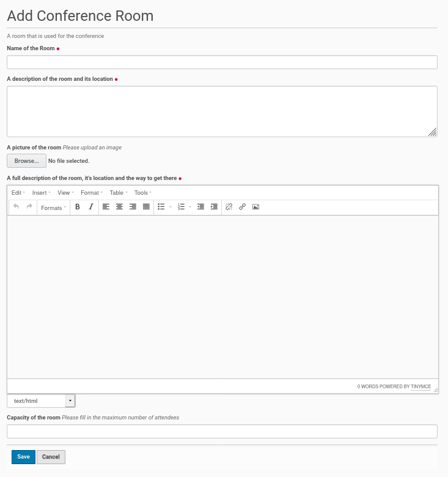

Conference Room
===============

It's easy to add a new conference room to the Plone site. Just go to the
conference rooms folder of the site and click on 'Add new' inside the menu
bar on the left side. Choose from the opening submenu the entry 'Conference
Room' and it opens a form to create a new conference room (see screenshot
below).

The form has three mandatory fields, the first one for the rooms title and
further one for the description of the room in the form of a summary.
And last mandatory field is a RichText field for a detailed description of
the conference room with the ability to insert links and images.

The form offers the opportunity to upload a picture of the room and to add
its capacity (number of seats).

Once the fields were completed and the optional picture is uploaded save
the edit form and the conference room will be created.

The default state of the created room object will be 'private'. If you want
to change this state, click inside the menu bar on the left site on the entry
with this state and choose from the opening submenu 'Submit for Publication'
or if available 'Publish'.
