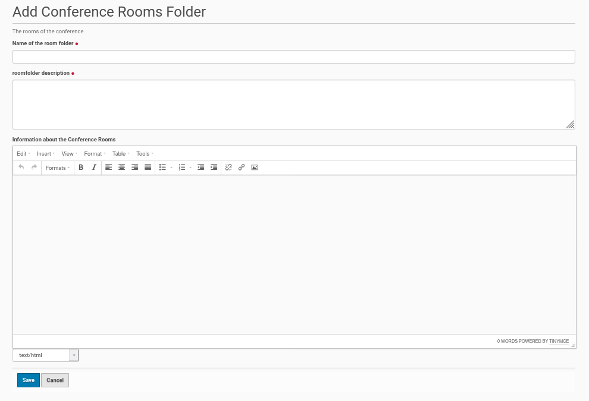

Add A Folder For Conference Rooms
=================================

The rooms of a conference are created and collected inside a folder. It is
very easy to create this folder within the root of the Plone site. Thus go
to the 'Home' of the Plone site and click in the menu bar on the left
side 'Add new' and choose from the opening submenu the entry 'Conference
Rooms Folder'. You will get the edit form for this folder (see screenshot
below).

This edit form has three fields. The first one is for the title of
the rooms folder and the second for a summary (short description).
This both fields are mandatory.

The third field is available for a longer, more detailed description /
information about the rooms of the conference. It is optional. The
rooms will be created inside this folder with their own content
(description etc.) inside this conference rooms folder later.

Once the fields were completed save the edit form and the conference rooms
folder will be created.

Publishing the room folder
**************************

The default state of the created folder will be 'private'. If you want to
change this state, click inside the menu bar on the left site on the entry
with this state and choose from the opening submenu 'Submit for Publication'
or if available 'Publish'.  If you could only submit the conference program
for publication a user with the appropriate permission need to publish the
program later.
