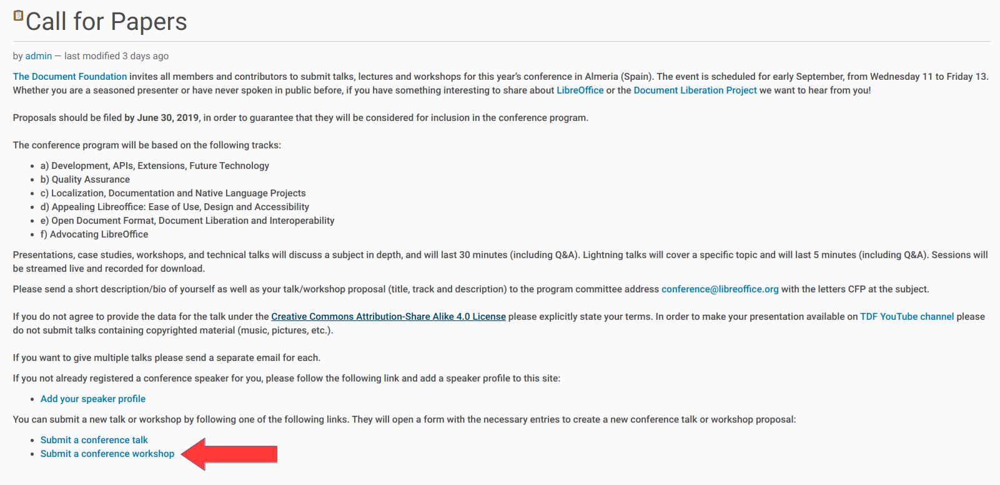
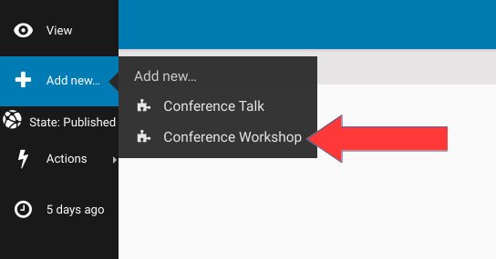
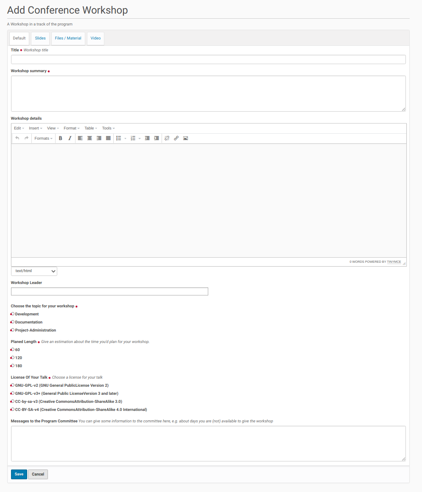
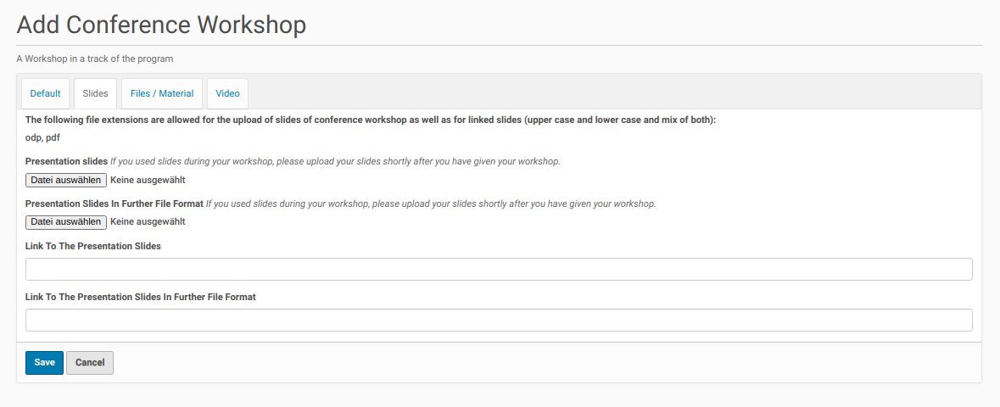
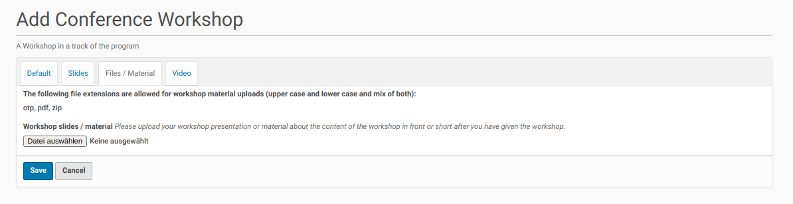
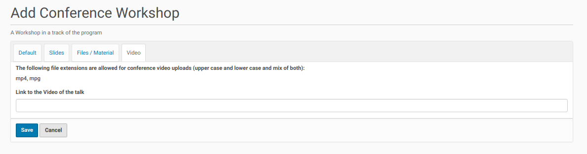

Add A New Workshop
==================

Once the call for papers was published and the folder for talks and workshop was created
registered users of the site could add proposals for workshops. There are different ways to
do this once they are logged-in to the site.

The easiest way is by using the link on the call for papers page (see the screenshot
below).

Once the user clicks on this link the edit form for a new workshop pops up.

The logged-in user could go instead of using this link to the folder for talks
and workshops (click on the appropriate link in the navigation menu bar) and click
inside the menu bar on the left side 'Add new'. Then choose from the opening submenu
the entry 'Conference Workshop' (see screenshot below).

This leads also to the edit form for a new workshop proposal. This form consists currently of
four register. The first register ('Default') contains fields for the necessary data of a
new workshop proposal (screenshot below).

A workshop (proposal) needs a unique title, a workshop summary and more detailed description. It should
have at least one presenter (workshop leader). But this is not mandatory to make it possible to create and
submit a new workshop (draft) and ask a competent workshop leader later to give this workshop (maybe with some
alignments).

The workshop needs an alignment with one of the call for paper topics thus the review committee could assign
it to the appropriate conference track. It's also necessary to get information about the planed length
of the workshop. The submitter of a new workshop (proposal) will know best which time slot fits to the
content of the workshop (the review committee / program owner could adapt this suggestion to the available
time slots of the program later). The entry in the field is only a proposal.

It's also necessary that the submitter of a talk proposal adapt one of the available licenses to the
workshop. And it is possible to give some information to the review committee / the program owner,
e.g. about the availability or necessary environment to give the workshop.

Once the mandatory fields of the 'Default' register has been filled out the user could save his edits and
the new workshop (proposal) will be submitted to the review queue.

The further register of the dialog consists of the necessary fields to upload or link the slides of a
workshop (register 'slides'), some additional files / material (register 'files') and link to the
video of the workshop (if the talk was recorded) (register 'video') (see the screenshots below).

**Register 'Slides':**

**Register 'Files':**

**Register 'Video':**

