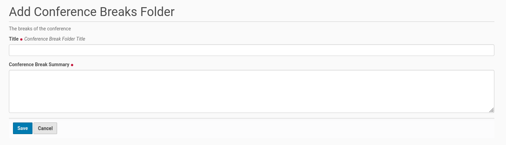

Folder For Conference Breaks
============================

The breaks of a conference are created and collected inside a folder. It is
very easy to create this folder within the root of the Plone site. Thus go
to the 'Home' of the Plone site and click in the menu bar on the left
side 'Add new' and choose from the opening submenu the entry 'Conference
Breaks Folder'. You will get the edit form for this folder (see screenshot
below).

This edit form has two fields, one for the title of the breaks folder and
another one for a summary (short description). Both fields are mandatory.
Once the fields were completed save the edit form and the conference breaks
folder will be created.
