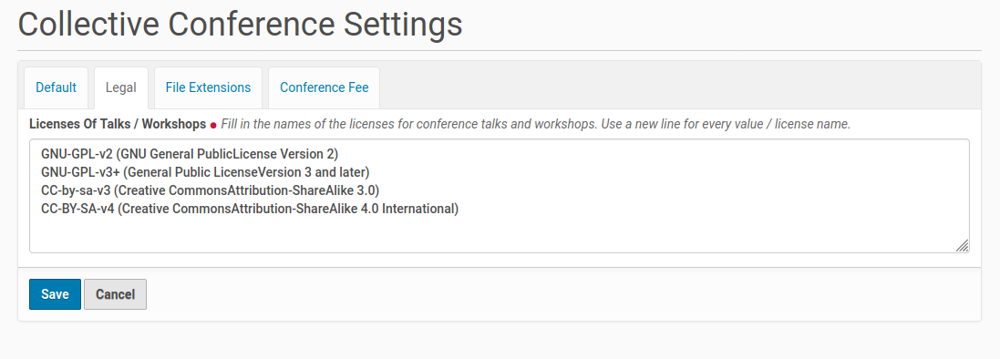

Configuration
=============

The configuration of the add-on could be done from the Plone controlpanel 'Site Setup'.
You already used this panel during the installation of the add-on. There are entries
for different configuration tasks.

Navigation configuration
************************

Next you need to go to the 'Navigation' configuration inside the 'Site Setup'.
Thus click on the corresponding button and you get to the configuration menu
in the screenshot below.

.. image:: images/navigation_collective_conferences_site.png
   :width: 600

Tick the checkboxes in front of the entries 'Conference', 'Conference Call for Paper', 'Conference Program',
'Conference Registration Folder', 'Conference Room', 'Conference Rooms Folder', 'Conference Speaker Folder',
'Conference Talk/Workshop Folder', 'Conference Training Folder' and 'Conference Track'. Then save your
changes. The necessary steps to setup the navigation of your conference site are done. You should continue
with the settings of the add-on (see the following chapter).

Collective Conferences Settings
*******************************

Once you finished the modification of navigation settings you could scroll down a bit
on the Site Settings page to the section for 'Add-on Configuration'. There you find a
new entry for this add-on with the title 'Collective Conference Settings'. Click on this
entry and you get a form with fields to configure the add-on.

.. image:: images/configuration_collective_conferences_form1.png
   :width: 600

The fields on the first register 'Default' collect the values for the length of conference breaks,
talks, trainings and workshops. This fields comes already with some default value. You could replace
this values with your own choice. Every single value needs a new line.

The entries of the fields for talk, training and workshop length will be used to configure the available options
for the talk, training and workshop proposal submitters to suggest a time slot. The values of the fields are also
used by the conference organization committee to set the length of talks, trainings, workshops and conference breaks
in the conference program and its tracks.

There are also fields to set the level and the audience of trainings at the conference. This fields hold already
some default values. You could replace them with your own choice / definitions, one value per line.

The second register 'Legal' currently holds only one field to list the licenses, talks, trainings and workshops
could be submitted under. This field came with some default values too. The default values could be replaced
by new entries. Every value needs a new line.

The third register ''File Extensions' need your input about the allowed file extensions for images (e.g.
pictures), for talk, training and workshop slides, for additional talk, training and workshop material
and conference videos. If there are different file extensions allowed for this file categories you could
enter this file extensions seperated by a pipe into the form fields, e.g.: 'odp|pdf' for slides.

The fourth register is used to configure a potential conference fee. The default value is 'no'
conference fee. If the conference visitors had to pay a fee the payment options could be set in
the appropriate field on this register. Every payment option needs to be written in a separate
line.

Once you finished the configuration within the fields of all three register save your changes.
This will write some new entries to the 'Configuration Registry' of the Plone site. This new
Configuration Registry entries will be used for the dynamic content of the edit forms of
talks, trainings and workshops.
