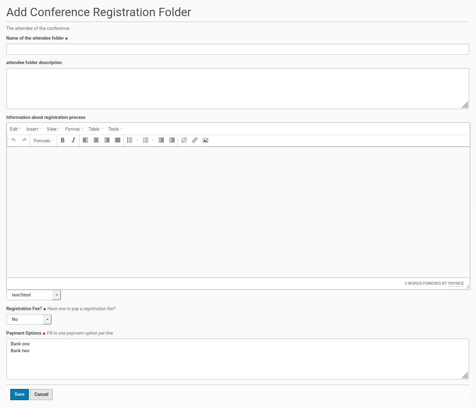
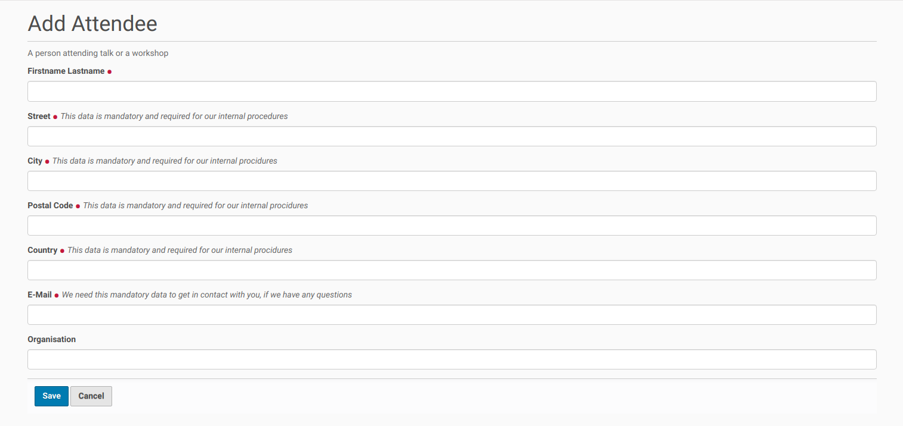
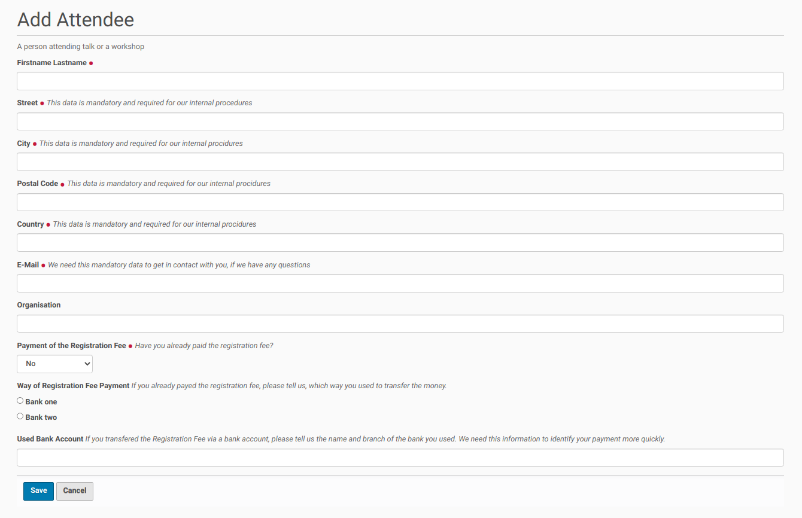
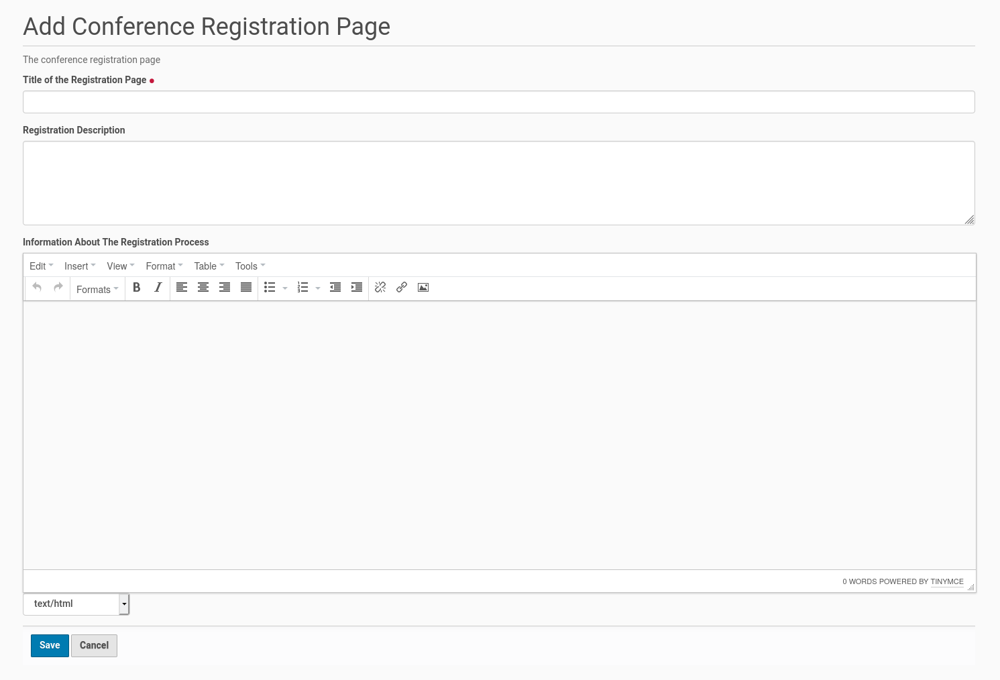
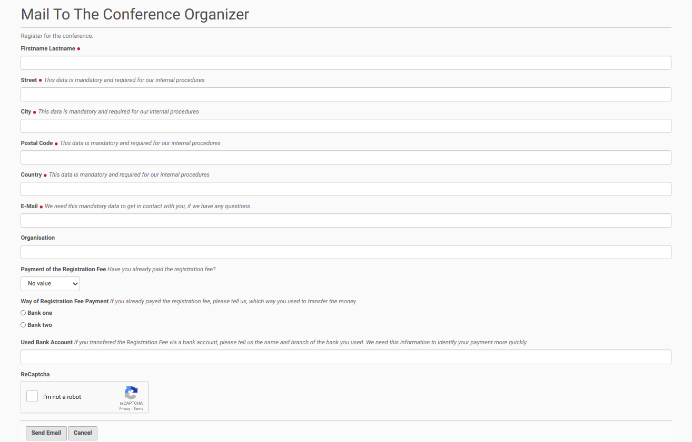

Conference Registration
=======================

Two Options To Do The Conference Registration
*********************************************

The collective.conferences Plone add-on provides two ways to process
the registration for a conference. The first option is done within
a folder of the site. If you choose this option everyone, who registers
for the conference, had to get an account on the site and create a
content object inside the registration folder.

The second option works with a page about the conference registration
process and use a mail form for the registration itself. If you choose
this option there is no need for an account and no content
object will be created on the site.

Option 1: Registration Done Inside A Folder
*******************************************

The registration of conference attendees will be done inside a folder
object within this option 1. This folder could be created inside the
root of the Plone site. Therefore go to the root of the Plone site and
click in the menu bar on the left side on the entry 'Add new' and choose
from the opening submenu 'Conference Registration Folder'. This opens the
edit form to create the folder for conference registrations (see
screenshot below).

The form starts with a field for the title of the registration folder. This
could be e.g. 'Registration'. This field is mandatory. It is followed by a
field for a description of the registration folder, which is optional.

The field with main information about the registration process follows.
This field is not mandatory, but it could and should be used to describe
the registration process, including e.g. a conference fee.

The following field needs an answer to the question about a conference fee.
If this field is set to 'yes' you need to carefully edit the field 'Payment
Options'. The strings in that field will be displayed in and used for the
registration form which a conference attendee has to fill out (see below).

Once the fields were completed save the edit form and the conference
registration folder will be created inside the Plone site root.

Publishing the registration (folder)
------------------------------------

The default state of the created folder will be 'private'. If you want to
change this state, click inside the menu bar on the left site on the entry
with this state and choose from the opening submenu 'Submit for Publication'
or if available 'Publish'. If you could only submit the conference
registration folder for publication a user with the appropriate permission
need to publish the folder later.

Conference Attendee Registration
--------------------------------

People, who want to register for the conference, first need to get an
account on the site and log-in. Thus they had first to register on
the site.

Once they logged-in they could click on the folder / page  for
conference registration, that was already created and published. There
they choose from the menu bar on the left the entry 'Add new' and click
in the opening submenu on the item 'Attendee'. This opens a form to add
a new conference attendee (see the screenshot below).

The attendee has to fill in his full name, his address and his e-mail
address into the form. If he is member of an organization he could
provide this information in the last field of the form.

If a conference attendee has to pay a conference fee (the appropriate
field in the registration folder edit form is set to yes; see above),
the registration form for the attendee contains three further fields
(see screenshot below).

The first field asks, if the conference fee has already been payed.
The next question is about the used bank account out of a list of
available accounts (they are added on the registration folder edit
form). The last field is about the users bank account, which was
used for the payment.

Once the attendee has filled in the necessary information she/he could
save the form and the registration finished. A new attendee will be
created. The default state is 'private'.

Option 2: Page About Registration And Mail Form
***********************************************

If you prefer to do the conference registration process within a
mailing to the conference committee (and its e-mail address) instead,
you can create in your Plone instance a conference registration page with
information about the conference registration process. The view of this
registration page will contain a link to a mail form.

You could add this registration page inside the root of your Plone site by
clicking on the entry 'Add new' in the menu on the left side. Then choose
the entry 'Conference Registration Page' from the opening sub-menu. You will
get a form to create the registration page (see screenshot below).

The form contains a mandatory field for the title of the registration page. The
further fields for a summary ('Registration Description') and detailed information
about the registration process ('Information About The Registration Process') are
optional fields. But it is necessary to add here the necessary information about
the registration proceding for the people which want to take part in the conference.
Thus this fields are only techinically optional.

Publishing the registration page
--------------------------------

The default state of the created registration page will be 'private'. If you want to
change this state, click inside the menu bar on the left site on the entry
with this state and choose from the opening submenu 'Submit for Publication'
or if available 'Publish'. If you could only submit the conference
registration page for publication a user with the appropriate permission
need to publish the page later.

Conference Registration by Email
---------------------------------

Once the conference registration is published every visitor of the site will find a
link to an email form on this page. If the user clicks on this link a form opens
with fields for the necessary user data for the conference registration process (see
the screenshot below).

The attendee needs to submit his name and contact address. He had also to fill in a
valid email address. If the attendee has to pay a conference fee the form contains
(like in the screenshot above) field to inform the organization committee, if the
fee was already payed, on which bank account and from which bank account. This makes
it easier for the organization committee to find the payment data of the conference
attendee.

The form is secured with a recaptcha field. Once the user filled the necessary data
into the fields and got the recaptcha challenge solved she/he could press the 'Send
Email' button and an email will be send to the default email address of the Plone
instance. This email address has been configured inside the administration page of
the Plone instance by the administrator.